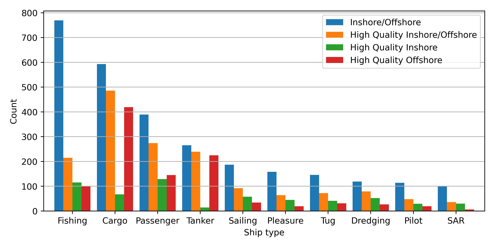
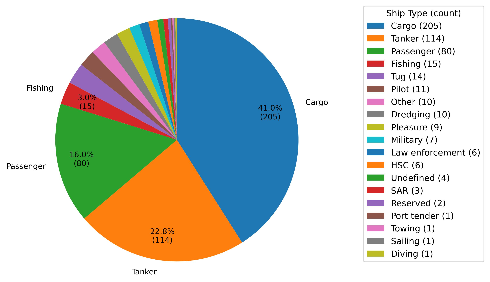
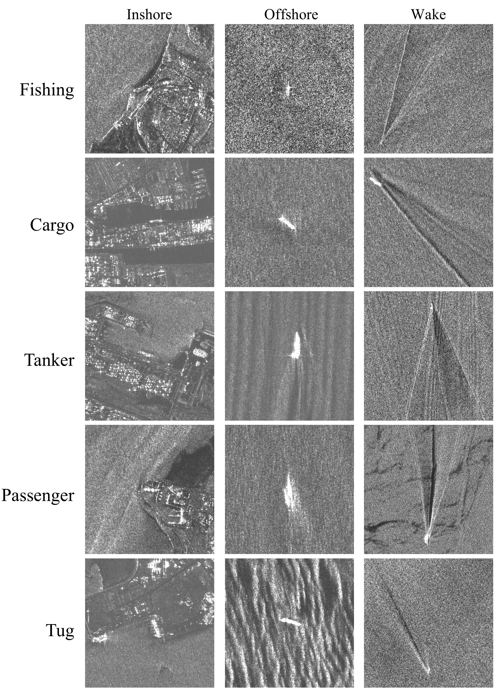

# NASTaR
 NovaSAR-Based Automated Ship Target Recognition Dataset

This repository provides benchmark experiments of deep learning models on the NASTaR dataset.

The NovaSAR Automated Ship Target Recognition (NASTaR) comprises 3415 ship patches extracted from NovaSAR S-band imagery, with labels aligned to AIS (Automatic Identification System) data. Key features of the dataset include: 23 distinct ship classes, separation between inshore and offshore samples, and an auxiliary wake dataset containing 500 patches where ship wakes are visible. 

The following bar chart, pie chart, and figure illustrate the distribution of ship types for the extracted patches, including those that feature wakes, as well as some examples of these patches.

 

 

 

## Experiments on EfficientNet

### Inshore and Offshore Scenario

| **Categories**                              | **OA**        | **AA**        | **APr**       | **AF1**       |
|:-------------------------------------------|:-------------:|:-------------:|:-------------:|:-------------:|
| Fishing, Other                             | 87.6 ± 2.9    | 78.2 ± 5.5    | 79.0 ± 4.8    | 77.6 ± 4.5    |
| Fishing, Cargo                             | 88.5 ± 3.3    | 84.7 ± 4.9    | 87.9 ± 3.5    | 85.8 ± 4.4    |
| Cargo, Tanker                              | 75.4 ± 1.6    | 65.7 ± 2.1    | 76.4 ± 4.0    | 66.7 ± 2.5    |
| Fishing, Cargo, Tanker                     | 70.8 ± 2.4    | 67.8 ± 1.9    | 71.2 ± 3.4    | 68.5 ± 2.4    |
| Fishing, Passenger, Cargo, Tanker          | 61.9 ± 1.5    | 58.1 ± 2.5    | 64.5 ± 1.8    | 59.6 ± 2.1    |

---

### Offshore Scenario

| **Categories**                              | **OA**        | **AA**        | **APr**       | **AF1**       |
|:-------------------------------------------|:-------------:|:-------------:|:-------------:|:-------------:|
| Fishing, Other                             | 91.1 ± 2.0    | 76.8 ± 7.5    | 78.5 ± 4.8    | 76.5 ± 5.7    |
| Fishing, Cargo                             | 91.9 ± 3.4    | 83.0 ± 7.2    | 90.0 ± 4.3    | 85.5 ± 6.5    |
| Cargo, Tanker                              | 74.6 ± 1.8    | 66.4 ± 2.2    | 76.2 ± 3.5    | 67.2 ± 2.6    |
| Fishing, Cargo, Tanker                     | 70.7 ± 3.1    | 66.4 ± 2.0    | 72.2 ± 4.3    | 68.0 ± 2.2    |
| Fishing, Passenger, Cargo, Tanker          | 61.6 ± 1.5    | 54.7 ± 3.6    | 63.1 ± 2.0    | 56.6 ± 3.2    |

---

### Inshore Scenario

| **Categories**                              | **OA**        | **AA**        | **APr**       | **AF1**       |
|:-------------------------------------------|:-------------:|:-------------:|:-------------:|:-------------:|
| Fishing, Other                             | 78.9 ± 6.8    | 75.9 ± 4.0    | 77.5 ± 5.1    | 75.2 ± 5.6    |
| Fishing, Cargo                             | 79.2 ± 5.6    | 78.3 ± 4.8    | 79.3 ± 5.4    | 77.7 ± 5.3    |
| Cargo, Tanker                              | 75.0 ± 9.1    | 60.7 ± 11.6   | 66.5 ± 17.3   | 60.2 ± 10.3   |
| Fishing, Cargo, Tanker                     | 68.5 ± 2.1    | 57.1 ± 5.2    | 71.8 ± 4.7    | 58.4 ± 5.4    |

