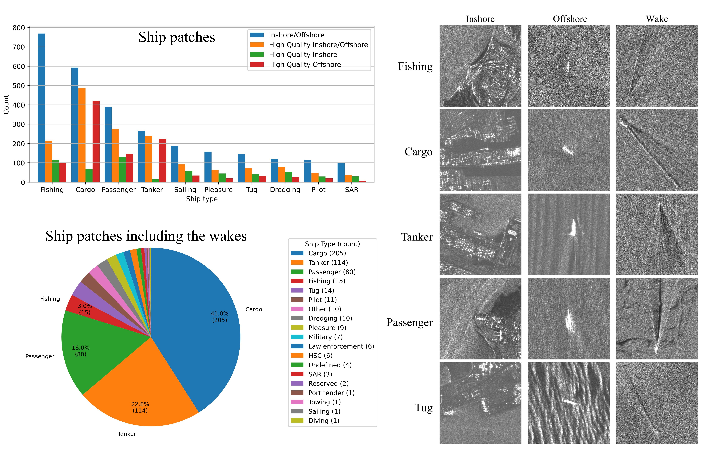

# NASTaR
 NovaSAR-Based Automated Ship Target Recognition Dataset

This repository provides benchmark experiments of deep learning models on the NASTaR dataset.


The NovaSAR Automated Ship Target Recognition (NASTaR) comprises 3415 ship patches extracted from NovaSAR S-band imagery, with labels aligned to AIS (Automatic Identification System) data. Key features of the dataset include: 23 distinct ship classes, separation between inshore and offshore samples, and an auxiliary wake dataset containing 500 patches where ship wakes are visible. 

Download the dataset from the following [link](https://data.bris.ac.uk/data/dataset/2tfa6x37oerz2lyiw6hp47058).

The following bar chart, pie chart, and figure illustrate the distribution of ship types for the extracted patches, including those that feature wakes, as well as some examples of these patches.

<p align="center">
 
</p>


## Experiments on ResNet50

| **Categories**                              | **OA**        | **AA**        | **APr**       | **AF1**       |
|:-------------------------------------------|:-------------:|:-------------:|:-------------:|:-------------:|
| Fishing, Other                             | 87.5 ± 1.6    | 74.1 ± 3.6    | 78.3 ± 3.4    | 75.6 ± 3.1    |
| Fishing, Cargo                             | 86.6 ± 2.2    | 84.3 ± 3.5    | 84.3 ± 2.3    | 84.2 ± 2.9    |
| Cargo, Tanker                              | 73.1 ± 2.4    | 65.2 ± 2.9    | 70.4 ± 3.9    | 66.0 ± 3.3    |
| Fishing, Cargo, Tanker                     | 67.0 ± 2.9    | 64.4 ± 3.0    | 66.2 ± 3.2    | 64.6 ± 3.0    |
| Fishing, Passenger, Cargo, Tanker          | 53.0 ± 1.7    | 49.3 ± 3.0    | 53.7 ± 2.1    | 49.8 ± 2.5    |

---

## Experiments on DenseNet121

| **Categories**                              | **OA**        | **AA**        | **APr**       | **AF1**       |
|:-------------------------------------------|:-------------:|:-------------:|:-------------:|:-------------:|
| Fishing, Other                             | 87.6 ± 3.0    | 75.4 ± 4.0    | 79.5 ± 5.6    | 76.5 ± 3.8    |
| Fishing, Cargo                             | 86.4 ± 2.5    | 84.5 ± 3.5    | 84.0 ± 2.9    | 84.1 ± 3.1    |
| Cargo, Tanker                              | 73.2 ± 1.8    | 66.0 ± 1.9    | 70.2 ± 3.0    | 66.9 ± 2.0    |
| Fishing, Cargo, Tanker                     | 68.8 ± 2.2    | 66.4 ± 2.4    | 68.6 ± 2.7    | 66.8 ± 2.4    |
| Fishing, Passenger, Cargo, Tanker          | 58.2 ± 1.8    | 54.5 ± 2.0    | 58.9 ± 2.4    | 55.5 ± 2.1    |

---

## Experiments on ResNext

| **Categories**                              | **OA**        | **AA**        | **APr**       | **AF1**       |
|:-------------------------------------------|:-------------:|:-------------:|:-------------:|:-------------:|
| Fishing, Other                             | 87.3 ± 1.1    | 72.5 ± 3.6    | 78.0 ± 2.3    | 74.5 ± 3.0    |
| Fishing, Cargo                             | 84.3 ± 2.2    | 80.3 ± 3.2    | 82.0 ± 2.6    | 81.0 ± 2.9    |
| Cargo, Tanker                              | 73.1 ± 2.3    | 65.7 ± 3.1    | 70.1 ± 3.4    | 66.5 ± 3.3    |
| Fishing, Cargo, Tanker                     | 68.3 ± 3.3    | 64.3 ± 3.4    | 68.4 ± 4.4    | 64.9 ± 3.6    |
| Fishing, Passenger, Cargo, Tanker          | 57.1 ± 2.4    | 54.0 ± 2.6    | 57.0 ± 2.7    | 54.7 ± 2.5    |

---

## Experiments on EfficientNet

| **Categories**                              | **OA**        | **AA**        | **APr**       | **AF1**       |
|:-------------------------------------------|:-------------:|:-------------:|:-------------:|:-------------:|
| Fishing, Other                             | 87.6 ± 2.9    | 78.2 ± 5.5    | 79.0 ± 4.8    | 77.6 ± 4.5    |
| Fishing, Cargo                             | 88.5 ± 3.3    | 84.7 ± 4.9    | 87.9 ± 3.5    | 85.8 ± 4.4    |
| Cargo, Tanker                              | 75.4 ± 1.6    | 65.7 ± 2.1    | 76.4 ± 4.0    | 66.7 ± 2.5    |
| Fishing, Cargo, Tanker                     | 70.8 ± 2.4    | 67.8 ± 1.9    | 71.2 ± 3.4    | 68.5 ± 2.4    |
| Fishing, Passenger, Cargo, Tanker          | 61.9 ± 1.5    | 58.1 ± 2.5    | 64.5 ± 1.8    | 59.6 ± 2.1    |

---

## Experiments on ViT

| **Categories**                              | **OA**        | **AA**        | **APr**       | **AF1**       |
|:-------------------------------------------|:-------------:|:-------------:|:-------------:|:-------------:|
| Fishing, Other                             | 83.5 ± 1.6    | 76.7 ± 3.5    | 71.9 ± 2.3    | 73.4 ± 2.0    |
| Fishing, Cargo                             | 86.9 ± 1.1    | 83.7 ± 2.2    | 85.2 ± 1.4    | 84.3 ± 1.5    |
| Cargo, Tanker                              | 74.4 ± 2.0    | 65.2 ± 3.3    | 73.7 ± 3.6    | 66.0 ± 3.9    |
| Fishing, Cargo, Tanker                     | 66.8 ± 3.6    | 62.5 ± 3.0    | 68.0 ± 4.0    | 63.8 ± 3.7    |
| Fishing, Passenger, Cargo, Tanker          | 58.0 ± 2.0    | 55.7 ± 2.3    | 57.6 ± 2.3    | 56.2 ± 2.4    |

---


## Citation
```
@article{hosseiny2025nastar,
  title={NASTaR: NovaSAR Automated Ship Target Recognition Dataset},
  author={Hosseiny, Benyamin and Kamirul, Kamirul and Pappas, Odysseas and Achim, Alin},
  journal={arXiv preprint arXiv:2512.18503},
  year={2025}
}
```